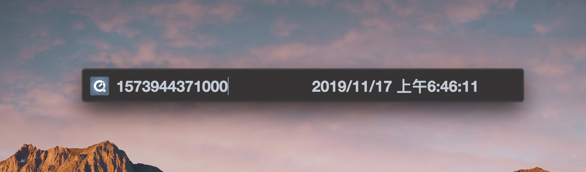

# Convert Timestamp

**tools convert to locale datetime string**

## Features

* auto convert timestamp to date string
* call out with keyboard shortcut: `OptionOrAlt+space`, like `spotlight` in macOs

## TODO

* automatic starting
* support ubuntu auto build
* sign code officially
* auto convert date string to timestamp
* custom keyboard shortcut
* more custom actions, like [alfred](https://www.alfredapp.com/)? maybe or not

## DevDependencies

* [nodejs](https://nodejs.org/)
* [electron](https://electronjs.org)
* [electron-builder](https://www.electron.build/)
* [electron-builder-action](https://github.com/marketplace/actions/electron-builder-action)

## Resources

* icon downloaded from https://icon-icons.com/